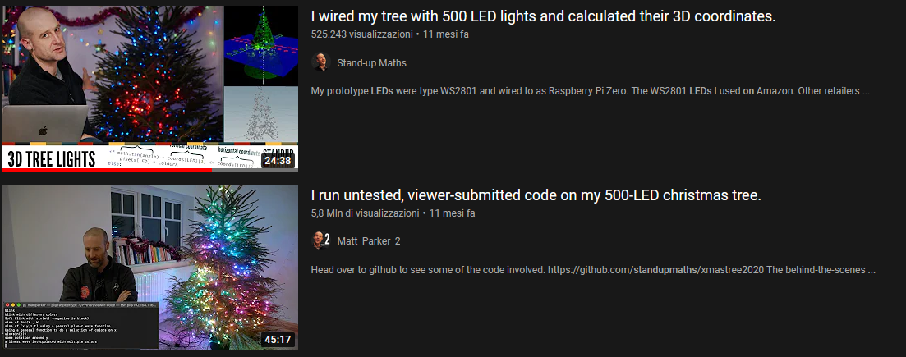

# rfxTree is a small prototype/weekend project to control addressable RGB Christmas tree lights a.k.a TreeTV

## Otherwise a Virtual Production project, that uses organic wood instead of expensive rigs, Christmas lights instead of expensive organic LED panels and cinematic action cameras 👀

[Virtual Production:](https://www.unrealengine.com/en-US/virtual-production)

![Virtual Production with Unreal Engine][vpue]

[vpue]: doc/vp.jpg "Virtual Production with Unreal Engine"

Virtual Production at home:

![Virtual Production at home][vpathome]

[vpathome]: https://user-images.githubusercontent.com/6011630/146373156-cc6657dd-6c42-423e-a668-45803968b410.mov "Virtual Production at home"

# Disclaimer
All trademarks, logos and brand names are the property of their respective owners. All company, product and service names used in this project are for identification purposes only. Use of these names, trademarks and brands does not imply endorsement nor association.

# Supported protocols:
- HTTP
- WebRTC data channel
- DMX over Art-Net

# Supported device:

- Twinkly Gen I devices

# Architecture

## Securability
Yes.

## Scalability
You don't have to trust me, check it yourself:

# Famous quotes
> Let's watch some tree. - A software engineer in the middle of the night following 2 years of lockdown

> 😮 - People that know what's up

# FAQ

- You use React wrong.
> Right.

- There is no separation of concerns and software engineering best practices.
> Read this README again. Also, just like the previous one, not a question.

# Related projects:

- This work was inspired by Matt Parker's Stand-up Maths video on [xmastree2020](https://github.com/standupmaths/xmastree2020) and controlling 500 NeoPixel LEDs

