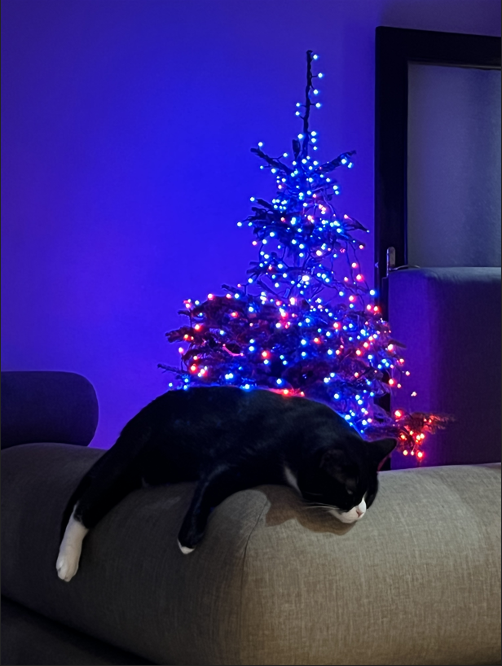

# rfxTree web app

This is a web control panel for devices connected to the rfxTree service

# It
- samples video files and drives color information to the backend service
- samples audio files and drives color information to the backend service
- samples image files or canvas drawings and drives color information to the backend service
- maps lights in 2D pixels spaced in [0.0, 1.0]
- plays squid game

This cat redirects to the main README file:

